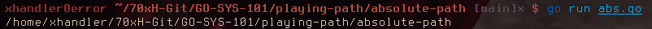
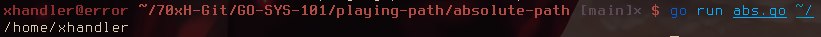

# Abs*() - Get absolute path

Get the absolute path.

## Function

```go
func Abs(dir string) (path string, err error)
```

* [Code](https://golang.org/src/path/filepath/path.go?s=7016:7053#L232)

## Examples

```
go run abs.go
```



```
go run abs.go ~/
```


