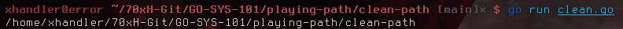
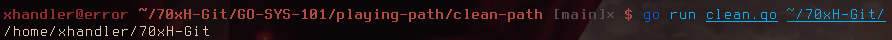

# Clean() - Get clean path

Returns the clean version of the path provided, like removing trails of `../` and `.`.

## Function

```go
func Clean(dir string) string
```

* [Code](https://golang.org/src/path/filepath/path.go?s=2501:2531#L78)

## Examples

```
go run clean.go
```



```
go run clean.go ~/70xH-Git/
```


