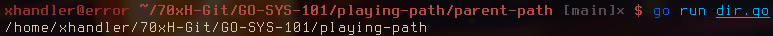

# Dir() - Gets parent path

This returns a path after removing the last element in the specified. It also uses the `Clean()` to remove the trailing slashes.

## Function

```go
fun Dir(path string) error
```

* [Code](https://golang.org/src/path/filepath/path.go?s=13914:13942#L455)

## Examples

```
go run dir.go
```



```
go run dir.go /home
```


