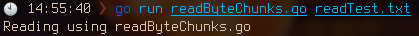

# Open(), Read(), Close() - Opens, Reads and Closes the file

Reading the file in chunks of bytes.

Remember to close the file after opening it, as it may cause problems which are not noticeable with less number of files.
Problems like:
  - reaching the limit of opening files
  - leaking
  - etc.

Previously we used `ReadFile()` function to open, read and close all at once, but as it has a disadvantage of reading all the contents and storing it in the memory - which may not be sufficient sometimes, we try to solve it by using the same specific amount of allocated memory - which is more efficient and useful.

## Function

```go
type Reader interface {
  Read(byteArr []byte) (n int, err error)
}
```

* [Code](https://golang.org/src/io/io.go?s=3303:3363#L67)
* This function takes in a byte array to store the buffer.
* It returns the number of bytes read and a special error defined in `os` package `EOF` (End Of File) - meaning that there is no content left to read.

## How does this work?

* When we first open the file using the function `os.Open(path string)`, it returns a `*File` - which a pointer to a File Descriptor.
* A File Descriptor is how opened files are stored in a table by Linux Kernel.
* This file descriptor is used by the applications to access the file.
* Consider the file descriptor as handle that holds the file and lets process use it.

* In the program we open the file, getting a pointer a File Descriptor of it.
* We then make a byte array to use it as buffer.
* Using the reader interface we read the contents (only the amount the array can withhold) and then print it.
* Repeat the process of reading and printing until we hit the EOF.
* Then the break the loop and return.

## Examples

```
go run readByteChunks.go readTest.txt
```


