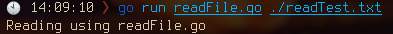

# ReadFile() - Reads the whole file at a time

Reads the specified file by loading it into memory. On success, returns `nil` and a byte array, on failure returns `EOF`.

## Function

```go
func ReadFile(string path) ([]byte, error)
```

* [Code](https://golang.org/src/io/ioutil/ioutil.go?s=1503:1549#L42)

## Examples

```
go run readFile.go ./readTest.txt
```


